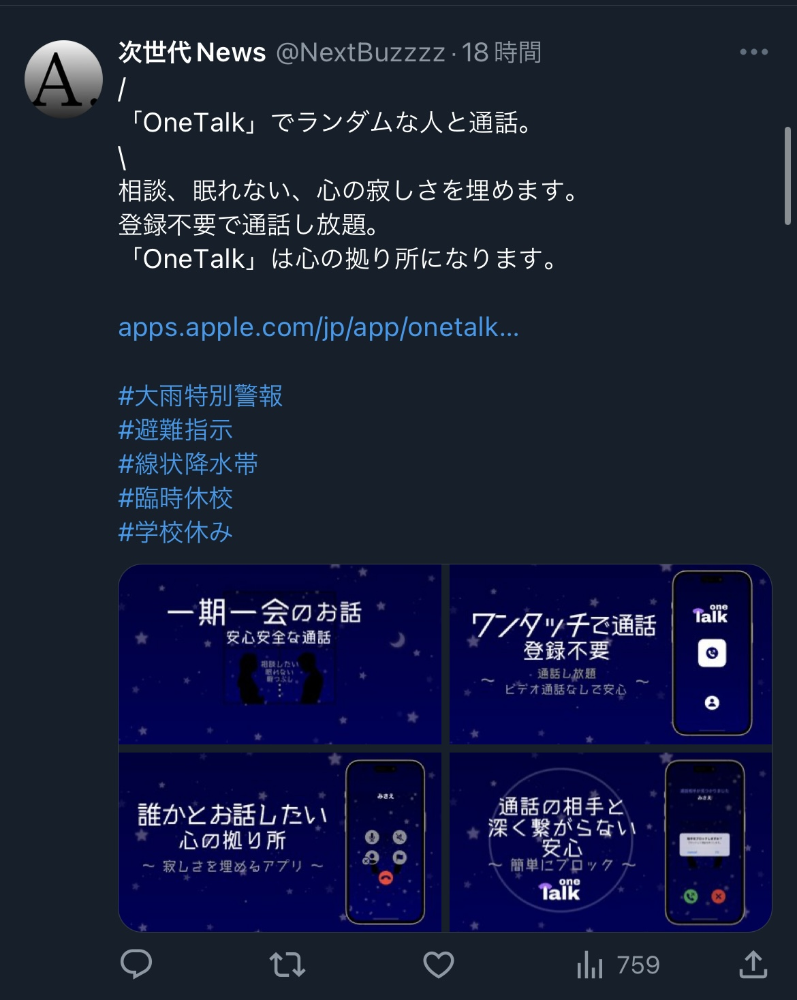

#  宣伝TweetBot
 
自作のアプリなどをtweeterで宣伝するためのBot。

簡単にTwitter上で宣伝できます。

1000viewなど得られるので、宣伝効果あります。

同じツイートはしないように設定されています。

- **tweet1.py**はEnd Point 1.1を利用するため、twitterのアカウントがElevated（有料）以上の方が利用できます。
- **tweet2.py**はChrome DriverとAPI（End Point 2.0）を用いてツイートする方法です。完全無料でできますが、スクレイピングを用いるのでツイッター利用規約に触れる可能性があるので自己責任でお願いいたします。


# Features
 
設定時間に一回ツイートします。  
ツイートの内容はカスタム可能ですが、デフォルトは以下のようになっています。  



設定したメッセージとその時のトレンドを含んだ文章が一定時間に一回ツイートされます。
 
 
# Installation&Setup

## tweet1.pyのSetUp

https://developer.twitter.com/en/portal/dashboard
で以下の4つ作成
- Consumer Key(API Key)
- Consumer Secret(API Secret)
- Access Token
- Access Token Secret

(許可設定はreadとwriteとapiの解析ができるように設定してください。)

同じ階層にsetting.pyファイルを作る  
中身は  
```setting.py
CONSUMER_KEY = '****'  
CONSUMER_SECRET = '****'  
ACCESS_TOKEN = '****'  
ACCESS_TOKEN_SECRET = '****'  
```
 
tweepyのインストール
 
```
pip install tweepy
```

実行
 
```
python tweet.py
```
停止  
```
ctrl + c
```

## tweet2.pyのSetUp

https://developer.twitter.com/en/portal/dashboard
で以下の4つ作成
- Consumer Key(API Key)
- Consumer Secret(API Secret)
- Access Token
- Access Token Secret

(許可設定はreadとwriteとapiの解析ができるように設定してください。)

同じ階層にsetting.pyファイルを作る  
中身は  
```setting.py
CONSUMER_KEY = '****'  
CONSUMER_SECRET = '****'  
ACCESS_TOKEN = '****'  
ACCESS_TOKEN_SECRET = '****'  
```
 
tweepyのインストール
 
```
pip install tweepy
```
 
beautifulsoup4のインストール
 
```
pip install beautifulsoup4
```
 
seleniumのインストール
 
```
pip install selenium 
```
 
Chromeのインストール

https://www.google.com/intl/ja/chrome/gsem/download/


Chrome Driverのインストール

https://chromedriver.chromium.org/downloads

Chrome Driverの配置場所のパスを指定
```tweet2.py
chrome_driver_path = ""
```


実行
 
```
python tweet.py
```
停止  
```
ctrl + c
```
 
# Note

- 以下の４つを漏らさないこと
```setting.py
CONSUMER_KEY = '****'  
CONSUMER_SECRET = '****'  
ACCESS_TOKEN = '****'  
ACCESS_TOKEN_SECRET = '****'  
```

- 使用は自己責任でお願いします
- Twitterの規約変更により一日のAPIの呼び出しが600?程に制限されました。そのため、ツイート頻度に注意。
- 一時間に127ツイートが上限です。
 
# License

https://rockreeee.github.io/profile-web-page/